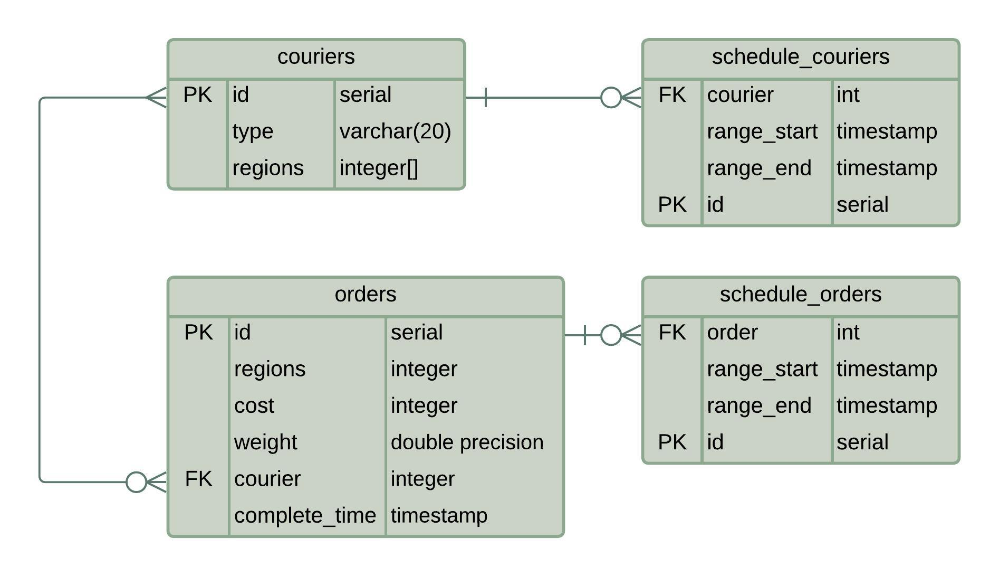

# Сборка jar

Выполнены задания 1-3

Сборка: `gradle bootJar` или `gradle bild`

При запуске **Dockerfile** или docker-compose отдельно собирать **jar** не нужно: в **Dockerfile** уже прописана сборка в отдельном временном контейнере

# Запуск с локальной базой данных
Для этого требуется работающий по адресу `localhost:5432` сервер **postgreSQL**

Сборка: `sudo docker build -t container .`

затем запуск: `sudo docker run --network host -t container`

(`--network host` нужен для того, чтобы в контейнере по адресу `localhost:5432` была доступна база данных. Иначе нужно пробрасывать порт `5432` контейнера на запущенный **postgreSQL** сервер)

Для настройки можно использовать определённые в **Dockerfile** переменные окружения

# Запуск с созданием контейнера базы данных

Осуществляется через **docker compose**.

Сборка: `sudo docker compose build`

затем запуск: `sudo docker compose up`

перед первым запуском убедитесь, что образ контейнера бвзы данных отсутствует, или находится в актуальном состоянии

Для доступа к базе данных можно настроить проброс портов (закомментированное поле `services.apps.db.ports:` в `docker-compose`)

# При успешном запуске
выводится сообщение `Service started successfully`

# База данных
**PostgreSQL**

DDL: `database/init.sql`

ERD:

Для выбора алгоритма работы с базой данных при запуске можно менять `spring.jpa.hibernate.ddl-auto` в `application.properties`

Сейчас база данных будет автоматически приводить таблицы к нужному виду, если это нужно, или использовать имеющиеся в ней данные.

(То есть при использовании одной и той же базы данных, информация, сохранённая в системе при предыдущем запуске, не будет потеряна)

# Используемые технологии

* Сервер: **Spring Boot**
* JPA: **Spring Data (Hibernate)**, **Repository API**
* Rate limiter: **Bucket4j**
* СУБД: **PostgreSQL**
* Контейнеризация: **Docker**
* Сборка: **Gradle**
* Контроль версий: **Git**
